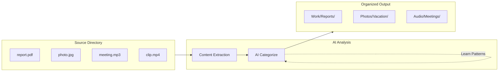

# Local File Organizer

[](https://github.com/curdriceaurora/Local-File-Organizer/actions/workflows/ci.yml)
[](CHANGELOG.md)
[](LICENSE)

This software uses AI to organize your local files. It operates locally with Ollama. It does not need a cloud connection. You can also connect it to an OpenAI-compatible endpoint or Anthropic Claude.


## Contents

- [Features](#features)
- [How It Works](#how-it-works)
- [Interfaces](#interfaces-visuals)
- [Quick Start (Essentials)](#quick-start-essentials)
- [Documentation](#documentation)
- [Optional Feature Packs](#optional-feature-packs)
- [Development](#development)
- [Contributing](#contributing)
- [Configuration](#configuration)
- [License](#license)

## Features

### AI and Analysis

- **AI-Powered Organization**: Uses Qwen 2.5 3B (text) and Qwen 2.5-VL 7B (vision) with Ollama. It also supports OpenAI-compatible endpoints and Anthropic Claude.
- **Audio Transcription**: Uses faster-whisper to convert local speech to text. This uses the GPU.
- **Video Analysis**: Finds scenes and gets keyframes from video files.
- **Intelligence**: Learns patterns, tracks your preferences, suggests actions, and adds tags automatically.

### Interfaces

- **Terminal UI**: Gives you an 8-view Textual TUI (Files, Analytics, Audio, History, Copilot).
- **Web UI**: Shows a browser interface with FastAPI and HTMX.
- **Desktop App**: Shows a native OS window with pywebview. It uses a single Python process. It does not use Electron or Rust.
- **Full CLI**: Includes commands to organize, set rules, suggest, find duplicates, run as a daemon, show analytics, update, and manage API keys.
- **Copilot Chat**: Lets you use natural language to give commands. For example, type "organize ./Downloads" or "undo".

### Organization

- **Extensive Support**: Operates on 840 tests, 408 modules, and 39 file types.
- **Organization Rules**: Sorts files automatically with conditions and previews. It saves rules in YAML.
- **PARA + Johnny Decimal**: Includes these organizational methodologies.
- **Deduplication**: Finds duplicate files with hash and semantic checks.
- **Undo/Redo**: Keeps a full history of operations so you can undo them.
- **Auto-Update**: Updates Linux AppImage from GitHub Releases. Updates macOS and Windows with `pip` or `pipx`.
- **Cross-Platform**: Operates on macOS, Windows, and Linux.

## How It Works



1. **Scan** — The software reads files from a source directory. It gets text, metadata, and visual content. It supports more than 80 formats.
2. **Analyze** — The software sends the content to an AI model. The model categorizes and names the files.
3. **Organize** — The software moves or copies files into folders. It uses the AI-generated names.
4. **Learn** — The software tracks your patterns and preferences to make better suggestions in the future.

## Interfaces (Visuals)

### Terminal UI


### Web UI (Preview)
To start the FastAPI server and open the UI, type this command:

```bash
file-organizer serve --reload
```

Then, go to `http://localhost:8000/ui/` in your browser.

## Quick Start (Essentials)

### With Ollama (local, default)

```bash
# Install from PyPI with pipx:
pipx install local-file-organizer
# or with pip:
pip install local-file-organizer

# 1) Set the default configuration
fo setup

# 2) Preview a folder before you change anything
fo preview ~/Downloads

# 3) Start the organization process
fo organize ~/Downloads ~/Organized

# 4) Undo the most recent organize run if necessary
fo undo
```

### Use cloud providers instead of the default local flow

Read the [AI Provider Setup guide](docs/setup/ai-providers.md) for OpenAI-compatible endpoints and Claude.

```bash
# OpenAI-compatible providers
export FO_PROVIDER=openai

# Anthropic Claude
export FO_PROVIDER=claude
```

## Documentation

### Essentials

- [Documentation Home](docs/index.md)
- [Getting Started](docs/getting-started.md)
- [CLI Reference](docs/cli-reference.md#core-first-run-commands)
- [User Guide Workflow Map](docs/USER_GUIDE.md#workflow-map-quick-paths)
- [Web UI Quick Start](docs/web-ui/getting-started.md)
- [Troubleshooting](docs/troubleshooting.md)
- [Installation Guide](docs/admin/installation.md)

### Advanced / Admin / Developer

- [Full CLI Reference](docs/cli-reference.md)
- [Terminal UI Guide](docs/tui.md)
- [Desktop App Guide](docs/desktop-app.md)
- [AI Provider Setup](docs/setup/ai-providers.md)
- [Audio & Video Processing Guide](docs/setup/audio-video.md)
- [Configuration Guide](docs/CONFIGURATION.md)
- [API Reference](docs/api/index.md)
- [File Format Reference](docs/admin/file-format-reference.md)
- [Path Standardization & Migration](docs/config/path-standardization.md)
- [Johnny Decimal User Guide](docs/methodologies/johnny-decimal/user-guide.md)
- [Johnny Decimal Migration Guide](docs/methodologies/johnny-decimal/migration.md)

## Optional Feature Packs

Canonical extras matrix:

- [Dependencies & Optional Extras](docs/setup/dependencies.md#optional-extras-matrix)

Common installation commands:

```bash
pip install "local-file-organizer[parsers,web]"
pip install "local-file-organizer[cloud,claude]"
pip install "local-file-organizer[all]"
```

> **From source (development):** Download the repository and use an editable install (for example, `pip install -e ".[all]"`).

### Audio system dependencies

To get full audio format support, the `[audio]` pack uses **FFmpeg** (all platforms). It optionally uses **CUDA + cuDNN** (for NVIDIA GPU users).

**FFmpeg** — This is necessary for non-`.wav` formats (MP3, M4A, FLAC, OGG). It is optional if you only transcribe raw `.wav` files:

```bash
# macOS
brew install ffmpeg

# Ubuntu / Debian
sudo apt install ffmpeg

# Windows (winget)
winget install ffmpeg
```

**CUDA + cuDNN** — This is optional. It makes transcription much faster.

```bash
# Install CUDA Toolkit from https://developer.nvidia.com/cuda-downloads
# Install cuDNN from https://developer.nvidia.com/cudnn

# Verify the full transcription backend
python3 -c "from faster_whisper import WhisperModel; print('faster-whisper OK')"
python3 -c "import torch; print('CUDA:', torch.cuda.is_available())"
```

**Fallback behavior**: If you do not have FFmpeg, the software only transcribes `.wav` files. It organizes other formats by filename and metadata, but it does not analyze their content. If you do not have CUDA, the transcription uses the CPU. This is slower but it operates correctly.

Read the [Installation Guide](docs/admin/installation.md) to find troubleshooting steps and advanced configuration options.

## Development

```bash
# Start tests
pytest

# Find errors with ruff
ruff check src/
```

*(To see a full breakdown of the project structure, read [CONTRIBUTING.md](CONTRIBUTING.md))*

## Contributing

Read [CONTRIBUTING.md](CONTRIBUTING.md) to learn about the development setup, coding standards, project structure, and how to submit your changes.

## Configuration

The software stores configuration files in these locations:
- **macOS**: `~/Library/Application Support/file-organizer/`
- **Linux**: `~/.config/file-organizer/` (or `$XDG_CONFIG_HOME/file-organizer/`)
- **Windows**: `%APPDATA%/file-organizer/`

Read the [Configuration Guide](docs/CONFIGURATION.md) for more data.

## License

This project uses the [MIT License](LICENSE).

---

**Status**: Stable | **Version**: 2.1.0 | **Last Updated**: 2026-07-05
