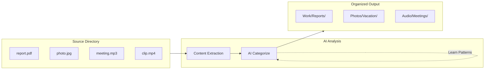

# Local File Organizer

[](https://github.com/curdriceaurora/Local-File-Organizer/actions/workflows/ci.yml)
[](CHANGELOG.md)
[](LICENSE)

AI-powered local file management. Local-first by default (Ollama, no cloud required)—or connect any OpenAI-compatible endpoint or Anthropic Claude when you need it.


## Contents

- [Features](#features)
- [How It Works](#how-it-works)
- [Interfaces](#interfaces-visuals)
- [Quick Start (Essentials)](#quick-start-essentials)
- [Documentation](#documentation)
- [Optional Feature Packs](#optional-feature-packs)
- [Development](#development)
- [Contributing](#contributing)
- [Configuration](#configuration)
- [License](#license)

## Features

### AI and Analysis

- **AI-Powered Organization**: Qwen 2.5 3B (text) + Qwen 2.5-VL 7B (vision) via Ollama — or any OpenAI-compatible endpoint (OpenAI, LM Studio, vLLM) — or Anthropic Claude
- **Audio Transcription**: Local speech-to-text with faster-whisper (GPU-accelerated)
- **Video Analysis**: Scene detection and keyframe extraction
- **Intelligence**: Pattern learning, preference tracking, smart suggestions, auto-tagging

### Interfaces

- **Terminal UI**: 8-view Textual TUI (Files, Analytics, Audio, History, Copilot, and more)
- **Web UI**: Browser-based interface via FastAPI and HTMX
- **Desktop App**: Native OS window via pywebview — single Python process, no Electron, no Rust
- **Full CLI**: Organize, rules, suggest, dedupe, daemon, analytics, update, api-keys
- **Copilot Chat**: Natural-language assistant -- "organize ./Downloads", "find report.pdf", "undo"

### Organization

- **Extensive Support**: Handles 840 tests, 408 modules, and 39 distinct file types natively
- **Organization Rules**: Automated sorting with conditions, preview, and YAML persistence
- **PARA + Johnny Decimal**: Built-in organizational methodologies
- **Deduplication**: Hash and semantic duplicate detection
- **Undo/Redo**: Full operation history
- **Auto-Update**: Linux AppImage self-updates from GitHub Releases (verified downloads + rollback); macOS/Windows update via `pip`/`pipx`
- **Cross-Platform**: Runs on macOS, Windows, and Linux (verified in CI). Linux ships a standalone AppImage plus executables; install on macOS/Windows via `pip`/`pipx`

## How It Works



1. **Scan** — Reads files from a source directory, extracting text, metadata, and visual content per file type (80+ formats supported)
2. **Analyze** — Sends extracted content to an AI model (Ollama, OpenAI, or Claude) for categorization and naming
3. **Organize** — Moves or copies files into a structured folder hierarchy with AI-generated names
4. **Learn** — Tracks your patterns and preferences over time for smarter future suggestions

## Interfaces (Visuals)

### Terminal UI


### Web UI (Preview)
Start the FastAPI server and open the UI:

```bash
file-organizer serve --reload
```

Then visit `http://localhost:8000/ui/` for the HTMX interface.

## Quick Start (Essentials)

### With Ollama (local, default)

```bash
# Install from PyPI — pipx keeps it isolated and on your PATH:
pipx install local-file-organizer
# or: pip install local-file-organizer

# 1) Configure defaults
fo setup

# 2) Preview a folder before changing anything
fo preview ~/Downloads

# 3) Run organization
fo organize ~/Downloads ~/Organized

# 4) Roll back the most recent organize run if needed
fo undo
```

### Need cloud providers instead of the default local flow?

Use the [AI Provider Setup guide](docs/setup/ai-providers.md) for OpenAI-compatible endpoints and Claude.

```bash
# OpenAI-compatible providers
export FO_PROVIDER=openai

# Anthropic Claude
export FO_PROVIDER=claude
```

## Documentation

### Essentials

- [Documentation Home](docs/index.md)
- [Getting Started](docs/getting-started.md)
- [CLI Reference](docs/cli-reference.md#core-first-run-commands)
- [User Guide Workflow Map](docs/USER_GUIDE.md#workflow-map-quick-paths)
- [Web UI Quick Start](docs/web-ui/getting-started.md)
- [Troubleshooting](docs/troubleshooting.md)
- [Installation Guide](docs/admin/installation.md) (Advanced dependencies and audio setup)

### Advanced / Admin / Developer

- [Full CLI Reference](docs/cli-reference.md)
- [Terminal UI Guide](docs/tui.md)
- [Desktop App Guide](docs/desktop-app.md)
- [AI Provider Setup](docs/setup/ai-providers.md)
- [Audio & Video Processing Guide](docs/setup/audio-video.md)
- [Configuration Guide](docs/CONFIGURATION.md)
- [API Reference](docs/api/index.md)
- [File Format Reference](docs/admin/file-format-reference.md)
- [Path Standardization & Migration](docs/config/path-standardization.md)
- [Johnny Decimal User Guide](docs/methodologies/johnny-decimal/user-guide.md)
- [Johnny Decimal Migration Guide](docs/methodologies/johnny-decimal/migration.md)

## Optional Feature Packs

Canonical extras matrix:

- [Dependencies & Optional Extras](docs/setup/dependencies.md#optional-extras-matrix)

Common installs:

```bash
pip install "local-file-organizer[parsers,web]"
pip install "local-file-organizer[cloud,claude]"
pip install "local-file-organizer[all]"
```

> **From source (development):** clone the repo and use an editable install
> instead, e.g. `pip install -e ".[all]"`.

### Audio system dependencies

For full audio format support, the `[audio]` pack uses **FFmpeg** (all platforms) and optionally **CUDA + cuDNN** (NVIDIA GPU users).

**FFmpeg** — required for non-`.wav` formats (MP3, M4A, FLAC, OGG); optional if you only transcribe raw `.wav`:

```bash
# macOS
brew install ffmpeg

# Ubuntu / Debian
sudo apt install ffmpeg

# Windows (winget)
winget install ffmpeg
```

**CUDA + cuDNN** — optional, for significantly faster transcription (see [faster-whisper benchmarks](https://github.com/SYSTRAN/faster-whisper) for hardware-specific numbers):

```bash
# Install CUDA Toolkit from https://developer.nvidia.com/cuda-downloads
# Install cuDNN from https://developer.nvidia.com/cudnn

# Verify the full transcription backend (not just PyTorch)
python3 -c "from faster_whisper import WhisperModel; print('faster-whisper OK')"
python3 -c "import torch; print('CUDA:', torch.cuda.is_available())"
```

**Fallback behavior**: without FFmpeg, only `.wav` files are transcribed; other formats are organized by filename/metadata but not content-analyzed. Without CUDA, transcription runs on CPU (slower but fully functional).

See the [Installation Guide](docs/admin/installation.md) for troubleshooting and advanced configuration.

## Development

```bash
# Run tests
pytest

# Lint
ruff check src/
```

*(For a full breakdown of the project structure, see [CONTRIBUTING.md](CONTRIBUTING.md))*

## Contributing

See [CONTRIBUTING.md](CONTRIBUTING.md) for development setup, coding standards, project structure, and how to submit changes.

## Configuration

Configuration is stored in platform-appropriate locations using `platformdirs`:
- **macOS**: `~/Library/Application Support/file-organizer/`
- **Linux**: `~/.config/file-organizer/` (or `$XDG_CONFIG_HOME/file-organizer/`)
- **Windows**: `%APPDATA%/file-organizer/`

See [Configuration Guide](docs/CONFIGURATION.md) for details.

## License

This project is licensed under the [MIT License](LICENSE).

---

**Status**: Stable | **Version**: 2.0.0 | **Last Updated**: 2026-07-05
