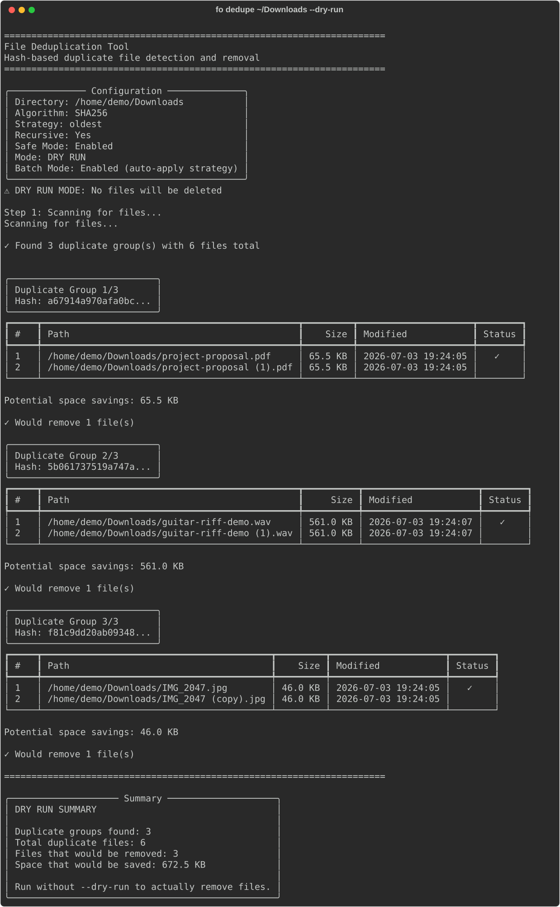

# File Organizer v2 User Guide

## Introduction

File Organizer v2 is an AI-powered local file management system. It uses a privacy-first architecture. It operates locally by default. It supports optional cloud providers.

## Essentials First Run (CLI)

Use this workflow to complete a first organization run. Do this before you explore advanced features:

```bash
fo setup
fo preview ~/Downloads
fo organize ~/Downloads ~/Organized
fo undo
```

Use `fo undo` after you record at least one organize run.

Do you prefer a browser? Start with the [Web UI Quick Start](web-ui/getting-started.md).

## Installation

### Prerequisites

- You must install Python 3.11 or higher.
- You must install and start [Ollama](https://ollama.ai/).
- You must have 8 GB RAM minimum. We recommend 16 GB.
- You must have 10 GB disk space for AI models.

### Setup

```bash
# Clone the repository
git clone https://github.com/curdriceaurora/Local-File-Organizer.git
cd Local-File-Organizer

# Create a virtual environment
python3 -m venv venv
source venv/bin/activate  # On Windows: venv\Scripts\activate

# Install the package
pip install -e .

# Pull the required AI models
ollama pull qwen2.5:3b-instruct-q4_K_M    # Text model (~1.9 GB)
ollama pull qwen2.5vl:7b-q4_K_M           # Vision model (~6.0 GB)

# Verify the installation
file-organizer version
```

### Optional Feature Packs

Use the canonical extras matrix:

- [Dependencies & Optional Extras](setup/dependencies.md#optional-extras-matrix)

!!! note
    The audio and video packs require FFmpeg and optionally a CUDA-capable GPU. Read the [Audio & Video Setup Guide](setup/audio-video.md) to find detailed installation instructions, model selection data, and configuration steps.

## Workflow Map (Quick Paths)

Use this routing table to jump directly to a workflow.

| Goal | Start here | Go deeper |
|------|------------|-----------|
| Complete your first CLI organization run safely | [Essentials first run](#essentials-first-run-cli) | [Core first run commands](cli-reference.md#core-first-run-commands) |
| Run Copilot for a folder and get actionable output | [Copilot quick workflow](#quick-workflow-ask-verify-and-act) | [CLI `copilot` entry points](cli-reference.md#cli-copilot) |
| Navigate TUI quickly | [Terminal UI](#terminal-ui-tui) | [TUI keyboard map](tui.md#keyboard-shortcuts) |
| Do rules-based batch review before applying changes | [Rules batch review workflow](#rules-batch-review-workflow) | [CLI `rules` entry points](cli-reference.md#cli-rules) |
| Scan and resolve duplicates safely | [Deduplication](#deduplication) | [CLI `dedupe` entry points](cli-reference.md#cli-dedupe) |
| Manage profile-like setups across environments | [Profile workflow (current stable path)](#profile-workflow-current-stable-path) | [CLI profile behavior](cli-reference.md#cli-profile) |
| Organize through the browser UI | [Web UI](#web-ui) | [Web organization workflow](web-ui/organization.md#quick-workflow-plan-review-run-export) |
| Launch and tune desktop mode | [Desktop UI](#desktop-ui) | [Desktop launch workflow](desktop-app.md#quick-workflow-launch-configure-and-verify) |
| Browse/install plugins | [Plugin Marketplace](#plugin-marketplace) | [CLI marketplace entry points](cli-reference.md#cli-marketplace) |
| Pick PARA vs Johnny Decimal | [Methodology selection workflow](#quick-workflow-choose-a-methodology) | [Johnny Decimal user guide](methodologies/johnny-decimal/user-guide.md#getting-started) |

## CLI Commands Overview

File Organizer includes two equivalent commands: `file-organizer` and the short alias `fo`.

If you are a new user, start with `setup`, `preview`, `organize`, and `undo`. Then, explore the full command list.

| Command | Description |
|---------|-------------|
| `organize` | Move files from an input directory to an output directory. |
| `preview` | Show organization changes without moving files. |
| `search` | Find files by filename pattern or keyword. Use the optional `--type` filter. |
| `analyze` | Examine a file and show AI-generated metadata. |
| `tui` | Start the Terminal User Interface. |
| `serve` | Start the web UI server. |
| `desktop` | Open the native desktop window application. |
| `docs` | Build or serve the project documentation. |
| `undo` | Revert the last file operation. |
| `redo` | Apply a previously undone operation again. |
| `history` | Show the operation history. |
| `analytics` | Show storage analytics and insights. |
| `version` | Show the application version. |
| `config` | Show and change configuration. |
| `model` | Control AI models. |
| `autotag` | Get auto-tagging suggestions and do batch operations. |
| `copilot` | Start the AI assistant for file management questions. |
| `daemon` | Watch files in the background and organize them automatically. |
| `dedupe` | Find and resolve duplicate files. |
| `rules` | Manage custom organization rules. |
| `suggest` | Get smart file placement suggestions. |
| `update` | Find and install application updates. |
| `api-keys` | Make local API keys. |
| `marketplace` | Find and install community plugins. |
| `benchmark` | Start performance benchmarks. |
| `api` | Start the REST API server. |

## Organizing Files

### Basic Organization

The `organize` command analyzes files in an input directory. It moves them to categorized folders in an output directory:

```bash
# Dry run first to preview changes
file-organizer organize ~/Downloads ~/Organized --dry-run

# Run the actual organization
file-organizer organize ~/Downloads ~/Organized

# Verbose output for debugging
file-organizer organize ~/Downloads ~/Organized --verbose
```

### Previewing Changes

Use `preview` to get a quick dry-run view:

```bash
file-organizer preview ~/Downloads
```

### Searching Files

Search through organized files by filename pattern or keyword:

```bash
file-organizer search "quarterly report" ~/Organized
```

### Analyzing Individual Files

Examine what the AI detects about a specific file:

```bash
file-organizer analyze ~/Documents/report.pdf
```

## Terminal UI (TUI)

The TUI gives an interactive terminal interface to manage your files.


### Launching the TUI

```bash
file-organizer tui
```

### Views and Key Bindings

| Key | View |
|-----|------|
| `1` | File browser |
| `2` | Organized |
| `3` | Storage analytics |
| `4` | Methodology |
| `5` | Audio |
| `6` | History |
| `7` | Settings |
| `8` | Copilot chat |

Navigation: Use arrow keys to move, press `Enter` to select, press `q` to quit, press `?` for help.

!!! tip
    The Audio view (key `5`) includes transcription and analysis features. Read the [Audio & Video Setup Guide](setup/audio-video.md) to enable audio transcription.

## Copilot

The Copilot is an AI assistant. It answers questions about your files and does management tasks with natural language.


### Interactive Chat (REPL)

```bash
# Start an interactive session
file-organizer copilot chat

# Specify a working directory
file-organizer copilot chat --dir ~/Documents
```

### Single-Shot Mode

```bash
# Ask a single question
file-organizer copilot chat "How many PDF files are in my Documents folder?"
```

### Quick workflow: ask, verify, and act

```bash
# 1) Start a scoped REPL
file-organizer copilot chat --dir ~/Documents

# 2) Ask for an actionable plan
# "Find duplicates and suggest cleanup order"

# 3) Apply the suggested command path outside chat
file-organizer dedupe scan ~/Documents
```

To find more command patterns, read [CLI `copilot` entry points](cli-reference.md#cli-copilot).

## Daemon and Background Processing

The daemon monitors directories for new files. It organizes them automatically.

### Starting the Daemon

```bash
# Watch a directory
file-organizer daemon start --watch-dir ~/Downloads --output-dir ~/Organized

# Run in foreground (useful for debugging)
file-organizer daemon start --watch-dir ~/Downloads --output-dir ~/Organized --foreground

# Adjust poll interval (seconds)
file-organizer daemon start --watch-dir ~/Downloads --output-dir ~/Organized --poll-interval 30

# Dry-run mode (log actions without moving files)
file-organizer daemon start --watch-dir ~/Downloads --output-dir ~/Organized --dry-run
```

### Managing the Daemon

```bash
# Check daemon status
file-organizer daemon status

# Stop the daemon
file-organizer daemon stop
```

## Organization Methodologies

File Organizer includes multiple organization systems. Configure these methodologies with the `config edit` command or the TUI settings view.

### Default AI Organization

The default method uses AI. It analyzes file content and suggests categories based on the content itself. It does not only use file extensions.

### PARA Method

Projects, Areas, Resources, Archive. This is a productivity-focused system:

- **Projects**: Active work with deadlines
- **Areas**: Ongoing responsibilities
- **Resources**: Reference materials by topic
- **Archive**: Completed or inactive items

### Johnny Decimal

A numerical categorization system that uses `XX.YY` numbering:

- **Areas** (10-19, 20-29, ...): Broad categories
- **Categories** (X1, X2, ...): Specific sub-categories
- **IDs** (XX.01, XX.02, ...): Individual items

### Quick workflow: choose a methodology

1. **Web UI (`/ui/organize`) values:** start with `content_based` if you do not follow a folder system. Choose `para` for actionability. Choose `johnny_decimal` for stable numeric indexing.
2. **CLI config values (`file-organizer config edit --methodology ...`):** use `none` (content-based/default), `para`, or `jd`.
3. Start a dry run and compare the output quality before you commit:

```bash
file-organizer organize ~/Inbox ~/Organized --dry-run
```

Read [Johnny Decimal getting started](methodologies/johnny-decimal/user-guide.md#getting-started) when you select a numeric methodology.

## Deduplication

Find and resolve duplicate files with perceptual hashing (for images) and content-based comparison (for documents).



### Scanning for Duplicates

```bash
file-organizer dedupe scan ~/Documents
```

### Resolving Duplicates

```bash
file-organizer dedupe resolve ~/Documents
```

### Generating Reports

```bash
file-organizer dedupe report ~/Documents
```

!!! note
    Image deduplication requires the dedup optional pack: `pip install -e ".[dedup]"`

## Auto-Tagging

The auto-tagging system suggests and applies tags to files. It uses AI analysis of their content.

### Getting Tag Suggestions

```bash
# Suggest tags for files in a directory
file-organizer autotag suggest ~/Documents
```

### Applying Tags

```bash
# Apply specific tags to a file
file-organizer autotag apply ~/Documents/report.pdf finance quarterly
```

### Viewing Popular Tags

```bash
# List the most commonly used tags
file-organizer autotag popular
```

### Batch Operations

```bash
# Tag files in batch
file-organizer autotag batch ~/Documents

# View recently applied tags
file-organizer autotag recent
```

## Organization Rules

Rules let you stop AI decisions and use explicit patterns. When a file matches a rule, the software organizes it with that rule instead of the AI suggestion.

### Listing Rules

```bash
# List all rules
file-organizer rules list

# List rule sets
file-organizer rules sets
```

### Adding Rules

```bash
file-organizer rules add my-rule --pattern "*.invoice.*" --action move --dest "Documents/Financial"
```

### Previewing and Managing Rules

```bash
# Preview what a rule would match in a directory
file-organizer rules preview ~/Documents

# Remove a rule
file-organizer rules remove my-rule

# Export rules to a YAML file
file-organizer rules export --output rules-backup.yaml

# Import rules from a YAML file
file-organizer rules import rules-backup.yaml
```

### Rules batch review workflow

```bash
# 1) Preview rule effects against current files
file-organizer rules preview ~/Documents --set default

# 2) Review effect in dry-run apply mode
file-organizer rules apply ~/Documents --set default --dry-run

# 3) Run the real apply when satisfied
file-organizer rules apply ~/Documents --set default
```

Read [CLI `rules` entry points](cli-reference.md#cli-rules) to find all command options.

## Plugin Marketplace

Use marketplace commands to find and install plugins.

```bash
# Browse
file-organizer marketplace list --page 1 --per-page 20

# Inspect and install
file-organizer marketplace info example-plugin
file-organizer marketplace install example-plugin

# Verify installation and updates
file-organizer marketplace installed
file-organizer marketplace updates
```

Read [CLI `marketplace` entry points](cli-reference.md#cli-marketplace) for all subcommands.

## Smart Suggestions

Get AI-powered suggestions for where you should put files. The software uses your existing directory structure and past organization patterns.

### Getting Suggestions

```bash
# Suggest placements for files
file-organizer suggest files ~/Unsorted

# View detected patterns
file-organizer suggest patterns ~/Unsorted
```

### Applying Suggestions

```bash
file-organizer suggest apply ~/Unsorted
```

## Analytics

Look at storage analytics, file distribution, and organization metrics.

```bash
# Display analytics dashboard
file-organizer analytics
```

## Named Configuration Profiles

Use the `config` command to inspect or edit named profiles:

```bash
# Show the current profile
file-organizer config show

# Show a specific profile
file-organizer config show --profile work

# Edit a specific profile
file-organizer config edit --profile work --temperature 0.7
```

### Profile workflow (current stable path)

In current mainstream installs, profile workflows use named config profiles and settings import/export procedures.

```bash
# 1) Inspect profile-specific settings
file-organizer config show --profile work

# 2) Adjust profile behavior
file-organizer config edit --profile work --temperature 0.7
```

Use [Web Settings import/export](web-ui/settings.md#settings-uisettings) for UI-based transfer procedures.
To find the runtime status of CLI `profile` subcommands, read [CLI profile behavior](cli-reference.md#cli-profile).

## Undo and Redo

The software tracks all file move operations. You can reverse them.

```bash
# Undo the last operation
file-organizer undo

# Redo the last undone operation
file-organizer redo

# View operation history
file-organizer history
```

## Web UI

File Organizer includes a browser-based interface to manage files visually.

### Starting the Web Server

```bash
# Start with default settings (localhost:8000)
file-organizer serve

# Specify host and port
file-organizer serve --host 0.0.0.0 --port 9000
```

Then, open `http://localhost:8000/ui/` in your browser.
If setup is incomplete, the web UI goes to `http://localhost:8000/ui/setup`.

Quick path: [plan, review, run, and export from Web Organize](web-ui/organization.md#quick-workflow-plan-review-run-export).

## Desktop UI

File Organizer includes a native desktop window application to manage files.

### Launching the Desktop Application

```bash
# Launch with default settings
file-organizer desktop
# fo desktop

# Specify custom window properties
file-organizer desktop --title "My File Organizer" --width 1024 --height 768

# Compatibility script (still available)
file-organizer-desktop
```

Quick path: [Desktop launch/configuration workflow](desktop-app.md#quick-workflow-launch-configure-and-verify).

## Project Documentation

You can build or serve the local project documentation with the `docs` subcommand.

### Serving Documentation Locally

```bash
# Start the local documentation server (localhost:8001)
file-organizer docs

# Specify custom host and port
file-organizer docs --host 0.0.0.0 --port 9000
```

### Compiling Documentation to HTML

```bash
file-organizer docs --build
```

## Configuration

### Viewing Configuration

```bash
# Show current configuration
file-organizer config show

# Show configuration for a specific profile
file-organizer config show --profile work

# List available configuration profiles
file-organizer config list
```

### Editing Configuration

```bash
# Edit configuration interactively
file-organizer config edit

# Edit specific settings directly
file-organizer config edit --text-model "qwen2.5:3b-instruct-q4_K_M"
file-organizer config edit --vision-model "qwen2.5vl:7b-q4_K_M"
file-organizer config edit --temperature 0.7
file-organizer config edit --device auto

# Edit a specific profile's configuration
file-organizer config edit --profile work
```

## AI Model Management

### Listing Models

```bash
# List all available models
file-organizer model list

# Filter by type
file-organizer model list --type text
file-organizer model list --type vision
```

### Pulling Models

```bash
# Pull a model by name
file-organizer model pull qwen2.5:3b-instruct-q4_K_M
```

### Cache Management

```bash
# View model cache status
file-organizer model cache
```

## Self-Update

### Checking for Updates

```bash
# Check if a newer version is available
file-organizer update check

# Include pre-release versions
file-organizer update check --pre
```

### Installing Updates

```bash
# Download and install the latest version
file-organizer update install

# Dry run (download without installing)
file-organizer update install --dry-run
```

## Supported File Types

| Category | Formats |
|----------|---------|
| Documents | `.txt`, `.md`, `.pdf`, `.docx`, `.doc`*, `.csv`, `.xlsx`, `.xls`*, `.pptx` |
| Images | `.jpg`, `.jpeg`, `.png`, `.gif`, `.bmp`, `.tiff`, `.tif` |
| Video | `.mp4`, `.avi`, `.mkv`, `.mov`, `.wmv` |
| Audio | `.mp3`, `.wav`, `.flac`, `.m4a`, `.ogg` |
| Archives | `.zip`, `.7z`, `.tar`, `.tar.gz`, `.tgz`, `.tar.bz2`, `.rar` |
| Scientific | `.hdf5`, `.h5`, `.hdf`, `.nc`, `.nc4`, `.netcdf`, `.mat` |
| CAD | `.dxf`, `.dwg`, `.step`, `.stp`, `.iges`, `.igs` |

*Legacy formats (`.doc`, `.xls`) have limited support. The software can return `None` or require additional dependencies. Read the [File Format Reference](admin/file-format-reference.md) for more data.

!!! tip
    Some format categories require optional feature packs. Read [Optional Feature Packs](#optional-feature-packs) above. To find audio transcription and video analysis features, read the [Audio & Video Setup Guide](setup/audio-video.md).

## Privacy and Security

File Organizer keeps your data completely private:

- All AI operations run locally with Ollama. The software does not upload files or content to any cloud service.
- Network requests only:
  - Communicate with your local Ollama instance (localhost only)
  - Check for application updates (this is optional and you can stop it)
- The software does not collect telemetry, analytics, or usage tracking data.

## Troubleshooting

### Ollama Not Running

If you see connection errors, ensure Ollama is running:

```bash
ollama ps
```

If the software does not list models, pull the required models:

```bash
ollama pull qwen2.5:3b-instruct-q4_K_M
ollama pull qwen2.5vl:7b-q4_K_M
```

### Verbose Output

Add `--verbose` (or `-v`) to any command to see detailed logs:

```bash
file-organizer organize ~/Downloads ~/Organized --verbose
```

### Checking Health

Verify the API server is operating correctly:

```bash
curl http://localhost:8000/api/v1/health
```

To find more detailed troubleshooting procedures, read [Troubleshooting](troubleshooting.md).
