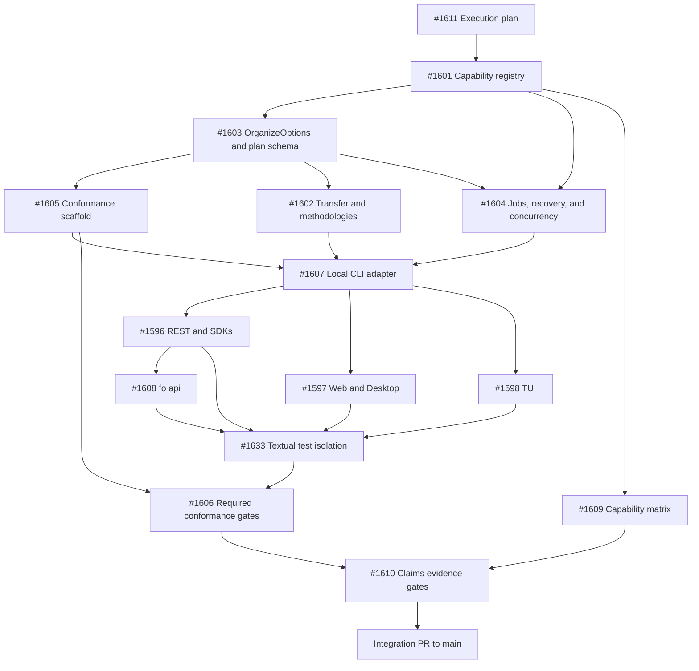

# Cross-Surface Parity Execution Plan

This document defines how contributors deliver the
[cross-surface claims-completeness epic](https://github.com/curdriceaurora/Local-File-Organizer/issues/1593).
GitHub issues own assignment and live status; this document owns the durable execution order,
integration policy, and contribution contract.

## Desired outcome

Every public capability has one canonical domain contract and an explicit support decision for
the CLI, REST API, Python SDK, TypeScript SDK, Web/Desktop, and TUI. Shared capabilities must use
the same defaults, validation, safety rules, plan semantics, execution results, lifecycle events,
and recovery guarantees. Presentation may differ.

The direct application service is the behavioral oracle. No adapter is allowed to define domain
policy or become the source of golden expectations.

## Integration branch

`feature/cross-surface-parity` is the shared integration branch for the epic.

- Create every parity branch from `feature/cross-surface-parity`.
- Target every parity pull request to `feature/cross-surface-parity`, never directly to `main`.
- Keep one issue slice per branch and pull request.
- Use `Part of #1593` in each pull request and close only the owned slice issue.
- Rebase or merge the latest integration branch before final review when shared contracts changed.
- Promote adapter conformance checks on the integration branch as the adapters land.
- Open one final integration pull request to `main` only after all required gates pass.

Suggested branch names follow the issue number:

```text
agent/parity-1601-capability-registry
agent/parity-1603-organize-contract
agent/parity-1605-conformance-scaffold
agent/parity-1607-cli-adapter
```

## Sources of truth

| Concern | Source of truth |
| --- | --- |
| Domain behavior | Canonical application service and contracts |
| Intended surface support | Capability registry `target_support` |
| Current implementation | Capability registry `implementation_status` |
| Executable evidence | Capability registry `conformance_status` and parity tests |
| Assignment and progress | GitHub epic, workstream parents, and slice issues |
| Execution order and contribution rules | This document |
| Public product claims | Generated capability matrix and evidence-backed docs |

Separating target, implementation, and conformance status prevents an early generated matrix from
presenting planned support as shipped behavior.

## Tracking hierarchy

The epic has two complementary views. The seven workstreams preserve the claims-completeness
scope, while the contributor queue contains the independently assignable execution units.

### Workstream roll-up

| Workstream | Scope |
| --- | --- |
| [#1594](https://github.com/curdriceaurora/Local-File-Organizer/issues/1594) | Canonical capability registry and application contracts |
| [#1595](https://github.com/curdriceaurora/Local-File-Organizer/issues/1595) | CLI parity |
| [#1596](https://github.com/curdriceaurora/Local-File-Organizer/issues/1596) | REST API and official SDK parity |
| [#1597](https://github.com/curdriceaurora/Local-File-Organizer/issues/1597) | Web and Desktop parity |
| [#1598](https://github.com/curdriceaurora/Local-File-Organizer/issues/1598) | TUI parity |
| [#1599](https://github.com/curdriceaurora/Local-File-Organizer/issues/1599) | Conformance fixtures, drivers, and enforcement |
| [#1600](https://github.com/curdriceaurora/Local-File-Organizer/issues/1600) | Generated capability matrix and evidence-backed claims |

#1594, #1595, #1599, and #1600 are parent roll-ups whose implementation is assigned through the
slices below. #1596, #1597, and #1598 are intentionally both workstream roll-ups and executable
items because they were not sub-sliced. This is not duplicate scope.

### Authoritative contributor queue

- Coordination: [#1611](https://github.com/curdriceaurora/Local-File-Organizer/pull/1611)
- Foundation and oracle: [#1601](https://github.com/curdriceaurora/Local-File-Organizer/issues/1601),
  [#1603](https://github.com/curdriceaurora/Local-File-Organizer/issues/1603),
  [#1605](https://github.com/curdriceaurora/Local-File-Organizer/issues/1605),
  [#1602](https://github.com/curdriceaurora/Local-File-Organizer/issues/1602), and
  [#1604](https://github.com/curdriceaurora/Local-File-Organizer/issues/1604)
- Adapters: [#1607](https://github.com/curdriceaurora/Local-File-Organizer/issues/1607),
  [#1596](https://github.com/curdriceaurora/Local-File-Organizer/issues/1596),
  [#1597](https://github.com/curdriceaurora/Local-File-Organizer/issues/1597),
  [#1598](https://github.com/curdriceaurora/Local-File-Organizer/issues/1598), and
  [#1608](https://github.com/curdriceaurora/Local-File-Organizer/issues/1608)
- Gate readiness: [#1633](https://github.com/curdriceaurora/Local-File-Organizer/issues/1633)
- Enforcement and claims: [#1606](https://github.com/curdriceaurora/Local-File-Organizer/issues/1606),
  [#1609](https://github.com/curdriceaurora/Local-File-Organizer/issues/1609), and
  [#1610](https://github.com/curdriceaurora/Local-File-Organizer/issues/1610)

### Precise workstream dependencies

- #1595 starts after #1603 and #1605, and merges after #1602 and #1604 stabilize. Its #1608
  `fo api` slice additionally waits for #1596.
- #1599 starts #1605 after #1603. #1606 lands incrementally with #1595 through #1598 and completes
  after their supported adapters are integrated. #1633 must close before TUI/conformance suites
  become required gates.
- #1600 starts #1609 after #1601. #1610 waits for both #1606 and #1609.

## Dependency graph



## Execution phases

### Coordination prerequisite

Merge #1611 into `feature/cross-surface-parity` before implementation begins so every contributor
branches from the same execution contract and integration policy.

### Phase 0: foundation in reviewable slices

1. [#1601: capability registry and execution scope](https://github.com/curdriceaurora/Local-File-Organizer/issues/1601)
   defines stable capability IDs, surface support, local/remote/auth-gated scope, and separate
   target, implementation, and conformance status.
2. [#1603: `OrganizeOptions`, traversal, and plan schema](https://github.com/curdriceaurora/Local-File-Organizer/issues/1603)
   extends the existing `PLAN_SCHEMA_VERSION` and `SourceFingerprint` mechanisms rather than
   introducing a second plan format.
3. [#1602: transfer semantics and methodologies](https://github.com/curdriceaurora/Local-File-Organizer/issues/1602)
   defines copy/hardlink behavior, decides whether true move is supported, and reconciles Web
   remapping with the existing PARA and Johnny Decimal packages.
4. [#1604: errors, jobs, scheduling, recovery, and concurrency](https://github.com/curdriceaurora/Local-File-Organizer/issues/1604)
   defines lifecycle semantics and protects shared job/history/undo state across surfaces.

True move is a decision, not an assumed deliverable. It must either receive complete cross-device,
crash-recovery, audit, and rollback semantics or be declared unsupported and removed from claims.

### Phase 1: executable oracle and first adapter

Start [#1605: the fixture corpus and direct-service driver](https://github.com/curdriceaurora/Local-File-Organizer/issues/1605)
as soon as #1603 exposes the canonical service. It may proceed alongside the tail of #1602 and
#1604. The scaffold begins as an advisory check.

Then land [#1607: the local CLI adapter](https://github.com/curdriceaurora/Local-File-Organizer/issues/1607).
The CLI is the first adapter because it exposes the broadest option set with the least presentation
noise. It validates the contract, but the direct service remains the oracle. The remote `fo api`
tail is deliberately deferred.

### Phase 2: adapter integration

After the relevant contracts and CLI driver stabilize:

- [#1596: REST API and official SDKs](https://github.com/curdriceaurora/Local-File-Organizer/issues/1596)
  and [#1597: Web/Desktop](https://github.com/curdriceaurora/Local-File-Organizer/issues/1597)
  may proceed concurrently.
- [#1598: TUI](https://github.com/curdriceaurora/Local-File-Organizer/issues/1598) starts when
  capacity is available.
- [#1608: `fo api`](https://github.com/curdriceaurora/Local-File-Organizer/issues/1608)
  follows #1596 and completes the CLI workstream.

Web/Desktop is the primary stress test for recursion and methodology drift. REST/SDK work owns
OpenAPI-to-Python/TypeScript coverage. TUI work owns cross-view workspace state and removal of
hard-coded working-directory defaults.

### Gate-readiness prerequisite

[#1633: Textual test isolation](https://github.com/curdriceaurora/Local-File-Organizer/issues/1633)
removes the order-dependent class-level test pollution discovered after the TUI adapter landed. It
must close before #1606 promotes TUI or cross-surface conformance suites to required gates; a
known false timeout is not an acceptable blocking signal.

### Phase 3: enforcement

[#1606: adapter drivers and required gates](https://github.com/curdriceaurora/Local-File-Organizer/issues/1606)
lands incrementally. Each adapter suite is advisory while being migrated and becomes a required
feature-branch gate when that adapter is declared stable.

Desktop route behavior uses the Web driver. Native dialogs and reveal-in-file-manager behavior use
stubs, unit tests, and optional platform smoke tests; headless CI does not need to open OS dialogs.

### Phase 4: claims

[#1609: capability-matrix generation](https://github.com/curdriceaurora/Local-File-Organizer/issues/1609)
may begin after #1601. It must visibly distinguish planned, implemented, and verified support.

[#1610: claim evidence and freshness gates](https://github.com/curdriceaurora/Local-File-Organizer/issues/1610)
lands after conformance is green. Behavioral claims link to registry and conformance evidence.
Performance claims require reproducible commands, environment metadata, and generated-and-dated
benchmark output.

## Strict serial order

When one contributor performs the entire epic, use this order:

```text
#1611 → #1601 → #1603 → #1605 → #1602 → #1604 → #1607 → #1596 → #1608
→ #1597 → #1598 → #1633 → #1606 → #1609 → #1610
```

With multiple contributors, #1605 overlaps the tail of foundation work; #1596 and #1597 run in
parallel; #1598 begins when capacity is available; and #1609 can run alongside adapter migration.

## Contribution protocol

Before implementation:

1. Assign the slice issue to yourself or leave a claim comment.
2. Confirm its prerequisites have landed on `feature/cross-surface-parity`.
3. Create a branch from the latest integration branch.
4. Identify the capability IDs and canonical contracts affected.

Each pull request must include:

- the owned slice issue and `Part of #1593`;
- the contract or adapter boundary changed;
- compatibility and migration impact;
- tests actually run;
- conformance status changes;
- registry and generated-matrix updates when applicable;
- explicit follow-ups instead of unrelated opportunistic changes.

Avoid parallel edits to the same contract file without coordinating in #1593. Adapter contributors
should consume stable contracts, not add surface-specific fields or defaults to bypass a missing
contract decision.

## Gate-promotion policy

An adapter conformance suite becomes required only when:

1. its canonical contracts are merged;
2. its driver covers declared full/read-only capabilities;
3. known mismatches are resolved or explicitly classified;
4. the suite is stable on supported platforms;
5. failure output identifies the capability, adapter, and normalized field that drifted.

Required gates remain enabled on `feature/cross-surface-parity`. A regression is fixed on the
feature branch rather than bypassed to keep later slices moving.

## Integration completion

The feature branch is ready for its final pull request to `main` when:

- every epic workstream and execution slice is complete;
- all public capabilities have explicit support and execution scope;
- shared capabilities pass required cross-surface conformance;
- Python and TypeScript client inventories match public OpenAPI operations or tested exclusions;
- concurrency, scheduling, recovery, and transfer decisions are tested;
- the generated matrix reports no accidental or unverified support;
- public claims are current and linked to appropriate evidence;
- release notes explain compatibility changes and intentional surface-specific behavior.
