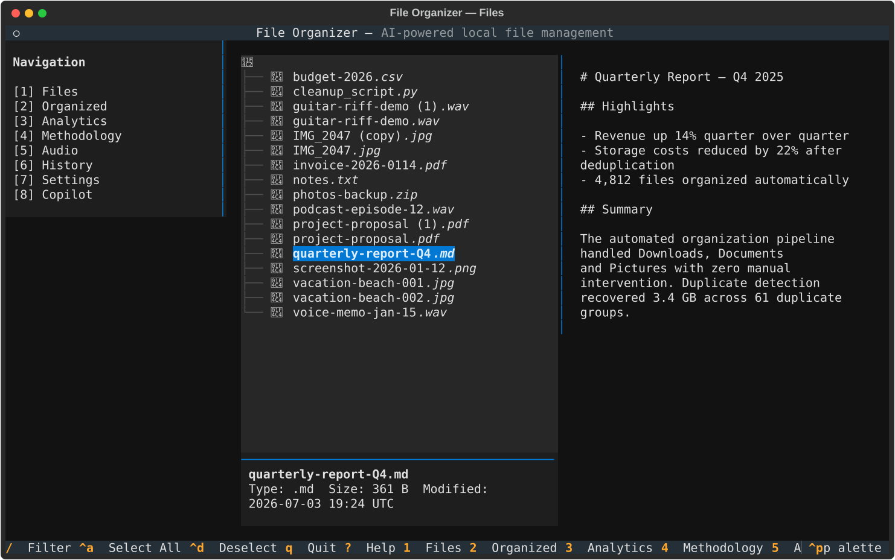
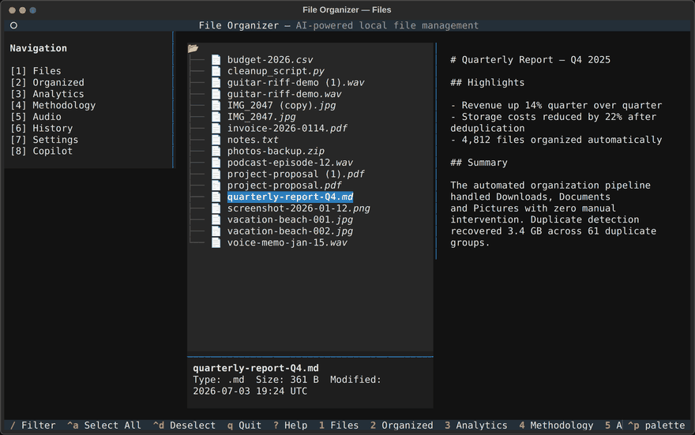
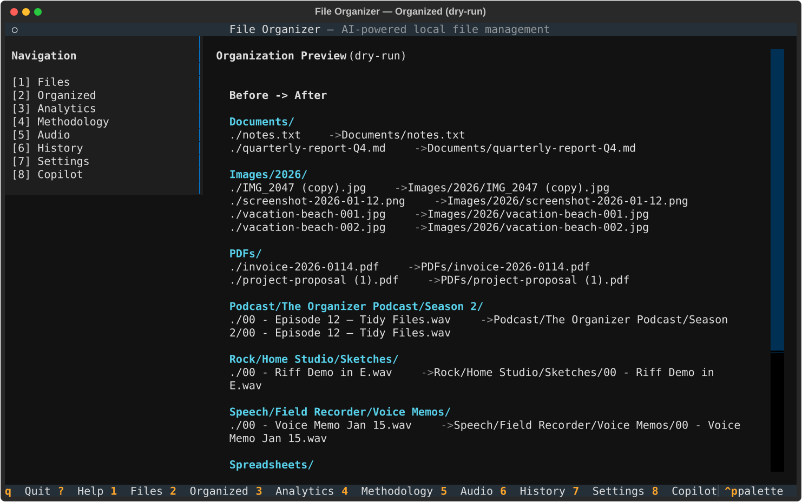
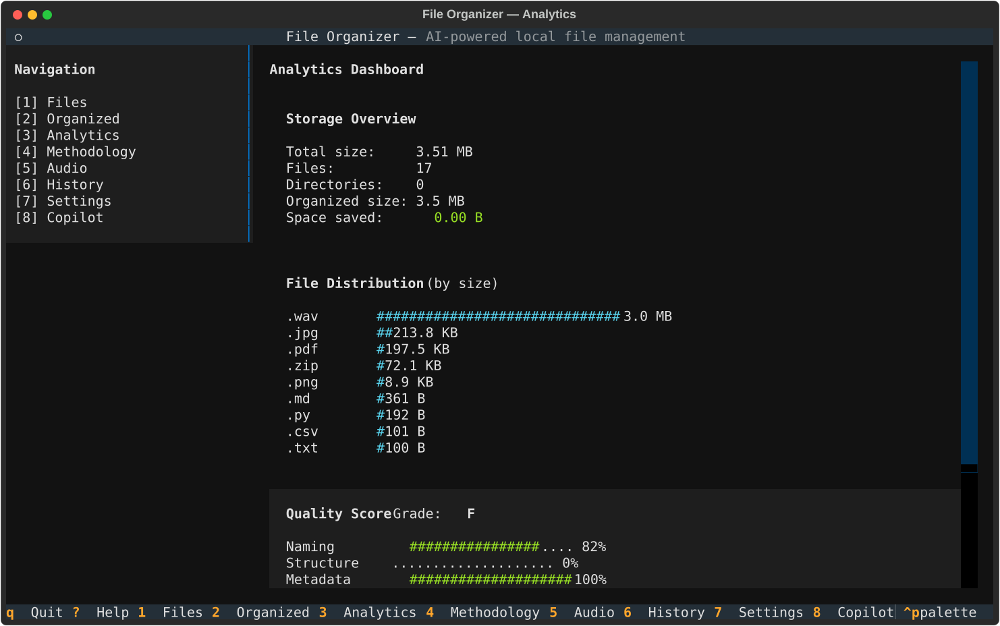
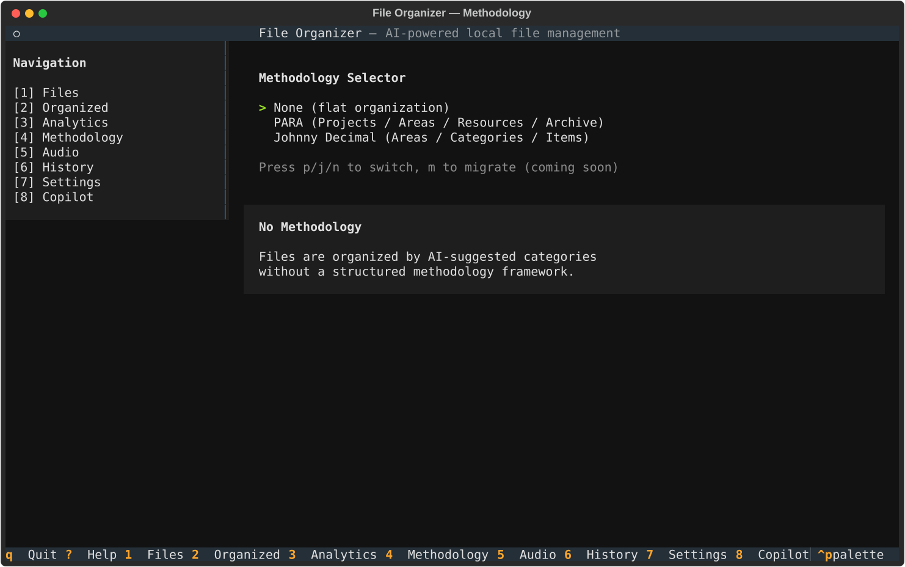
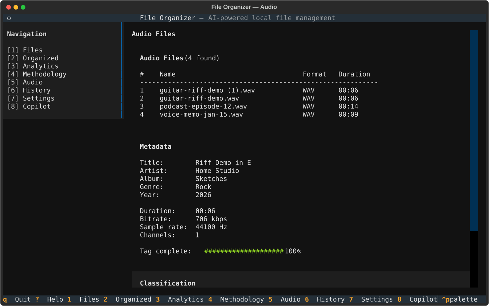
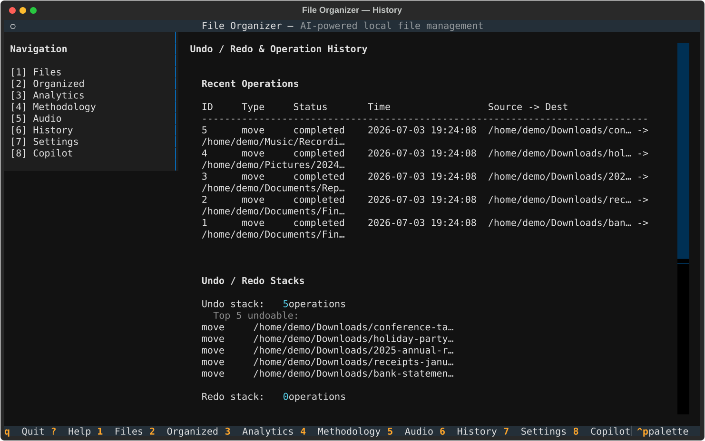
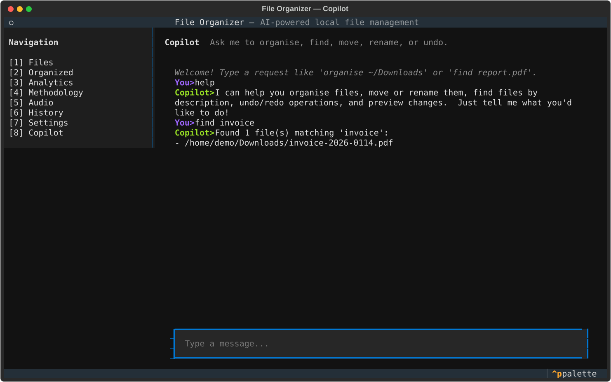

# Terminal User Interface (TUI)

> **Version**: 2.0.0

The TUI is built with Textual and launched from the unified CLI.

## Launch

```bash
file-organizer tui
# or
fo tui
```

## Quick workflow: navigate, inspect, and adjust

1. Launch the TUI and wait for the main layout (or finish setup wizard).
2. Jump across main views with `1`–`8` to inspect files, organization results, history, settings, and copilot.
3. Use `Tab` to move focus and `?` to confirm active bindings.
4. Open the Methodology view (`4`) to verify current strategy before running large organization jobs.

## Overview

The Files view combines the directory tree, metadata panel, and a live
type-aware preview of the highlighted file:



A quick walkthrough of the main views:



## View gallery

### Organized (`2`)

Dry-run preview of how the current directory would be organized:



### Analytics (`3`)

Storage overview, file-type distribution, quality score, and duplicate
statistics for the current directory:



### Methodology (`4`)

Choose between flat, PARA, and Johnny Decimal organization systems:



### Audio (`5`)

Scans the directory for audio files and shows tag metadata and
classification for the selected file:



### History (`6`)

Recent operations with undo/redo stacks:



### Copilot (`8`)

Natural-language file management backed by the local intent engine:



## Keyboard shortcuts

These are the global app-level bindings from `FileOrganizerApp.BINDINGS`.

### Global

| Key | Action |
|-----|--------|
| `q` / `Ctrl+c` | Quit |
| `?` | Toggle help |
| `Tab` | Focus next panel |
| `1`–`8` | Switch main view |
| `Ctrl+w` | Complete setup wizard (wizard flow) |

### View map (`1`–`8`)

| Key | View |
|-----|------|
| `1` | Files |
| `2` | Organized |
| `3` | Analytics |
| `4` | Methodology |
| `5` | Audio |
| `6` | History |
| `7` | Settings |
| `8` | Copilot |

## View-local bindings (examples)

The TUI also defines view-local bindings across modules (for example in `file_browser.py`, `organization_preview.py`, `settings_view.py`, `copilot_view.py`, and other view files).

Examples:

- File browser tree supports vim-style navigation (`h`, `j`, `k`, `l`)
- File browser filter toggle: `/`
- Other views expose local controls through their own `BINDINGS` declarations

## Setup wizard behavior

If setup is not completed, the TUI opens the setup wizard first and then transitions to the main app layout.

## Troubleshooting

### Garbled Display or Broken Colors

**Symptom**: Characters appear as raw escape codes, colors are missing, or the layout looks broken.

**Cause**: The terminal's `TERM` environment variable is set to a value that Textual cannot detect color support for, or the terminal emulator itself has limited color support.

**Solution**:

```bash
# Force 256-color or true-color mode
export TERM=xterm-256color
file-organizer tui

# If colors are completely wrong, try disabling color
export NO_COLOR=1
file-organizer tui

# Force color output on if the terminal supports it but detection fails
export FORCE_COLOR=1
file-organizer tui
```

If you use a multiplexer (tmux, screen), ensure it is configured to pass through true-color sequences:

```bash
# In ~/.tmux.conf
set -g default-terminal "tmux-256color"
set -ag terminal-overrides ",xterm-256color:RGB"
```

### Blank Screen on Launch

**Symptom**: The TUI opens but shows a blank or mostly-empty window for several seconds, then may recover or stay blank.

**Cause**: Rare Textual rendering issue, typically triggered by very small terminal sizes or a terminal that mis-reports its dimensions.

**Solution**:

```bash
# Resize the terminal window to at least 80x24 before launching
file-organizer tui

# If the terminal stays blank, try resetting it first
reset
file-organizer tui
```

### Wizard Stuck or Not Completing

**Symptom**: The setup wizard does not advance, or pressing keys has no effect.

**Cause**: A required field may be unfilled, or the terminal is swallowing keypresses.

**Solution**:

- Press `Ctrl+W` (shown in the keyboard shortcuts table above) to complete/advance the wizard.
- Ensure the wizard panel has focus — click on it or press `Tab` to cycle focus.
- If the wizard loop persists after completing setup, restart the TUI:

```bash
file-organizer tui
```

### Keyboard Shortcuts Swallowed by Terminal Multiplexer

**Symptom**: Global shortcuts like `Ctrl+C`, `Ctrl+W`, or function keys do not reach the TUI when running inside tmux or screen.

**Cause**: tmux/screen intercepts certain key sequences before they reach the application.

**Solution**:

In **tmux**, use `send-keys` to inject the key directly into the foreground pane without going through tmux's binding layer:

```bash
# From another tmux window/pane, send Ctrl+W to the pane running the TUI
tmux send-keys C-w
```

If the shortcut conflicts with a tmux binding, unbind it for the copy-mode table (where `C-w` is most commonly bound):

```bash
# In ~/.tmux.conf
unbind -T copy-mode C-w
```

In **GNU screen**, press `Ctrl+a` then `a` to send a literal `Ctrl+a`, or use `stuff` to inject keys programmatically. For `Ctrl+W` specifically:

```bash
# From the screen command line (Ctrl+a :)
:stuff ^W
```

For persistent conflicts in either multiplexer, consider running the TUI in a dedicated terminal window outside the multiplexer.

## Related docs

- [CLI Reference](cli-reference.md)
- [Desktop App Guide](desktop-app.md)
- [Web UI Guide](web-ui/index.md)
